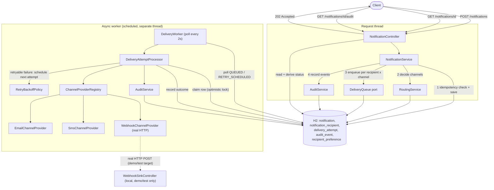

# Architecture

Notification Management Service — architecture overview, Architecture
Decision Records (ADRs), the three-scenario decomposition/execution/
validation walkthrough, and testing approach/limitations/trade-offs. See
`README.md` for setup/run instructions and the API reference.

## 1. System Overview

A Spring Boot 4 / Java 21 service that accepts notification requests from
upstream systems, decides delivery channels per recipient, dispatches
delivery attempts asynchronously with bounded retry/backoff, and exposes
status and audit history. Persistence is H2 (in-memory); scheduling and
persistence are the only infrastructure dependencies — no external broker,
cache, or message queue. Email and SMS are simulated; WEBHOOK makes a real
outbound HTTP call (see ADR-012).

**Components:**

| Component | Package | Responsibility |
|---|---|---|
| `NotificationController` | `notification` | HTTP surface: submit, get status, get audit trail |
| `NotificationService` | `notification` | Validation, idempotency check, orchestrates routing + queuing |
| `NotificationStatusCalculator` | `notification` | Pure function deriving overall status from delivery attempts |
| `RoutingService` | `routing` | Decides eligible channels per recipient |
| `DeliveryQueue` / `DeliveryAttemptQueue` | `delivery` | Port + adapter for enqueuing a delivery attempt |
| `DeliveryWorker` | `delivery` | `@Scheduled` poller — the async processing loop |
| `DeliveryAttemptProcessor` | `delivery` | Processes one delivery attempt per transaction, including retry/backoff decisions |
| `RetryBackoffPolicy` | `delivery` | Pure function: attempt count → exponential backoff delay |
| `ChannelProviderRegistry` + `EmailChannelProvider` / `SmsChannelProvider` / `WebhookChannelProvider` | `delivery` (+ `.providers`) | Channel adapters — Email/SMS simulated, Webhook real HTTP |
| `SimulatedFailureRules` | `delivery.providers` | Shared marker-based outcome rules for the simulated providers |
| `WebhookSinkController` | `delivery` | Local, non-public stand-in webhook receiver for deterministic demos/tests (see ADR-012) |
| `AuditService` | `audit` | Records audit trail events |

## 2. Control Flow



**Narrative:**
1. `POST /api/v1/notifications` validates the request, checks the
   `(sourceSystem, idempotencyKey)` dedup boundary, persists the
   `Notification` + `NotificationRecipient` rows, and records
   `NOTIFICATION_ACCEPTED`.
2. For each recipient, `RoutingService` decides eligible channels;
   `DeliveryQueue.enqueue(...)` persists one `DeliveryAttempt` row per
   recipient × channel; each step is audited (`ROUTING_DECIDED`,
   `DELIVERY_QUEUED`).
3. The request returns **202 Accepted** here — no delivery has happened yet.
   This is the asynchronous boundary: nothing past this point runs on the
   request thread.
4. `DeliveryWorker` polls for due rows every 2s (configurable), and hands
   each to `DeliveryAttemptProcessor`, which claims the row under optimistic
   locking, calls the resolved `ChannelProvider`, and records the outcome
   (`DELIVERY_ATTEMPTED` → `DELIVERY_SUCCEEDED` / `RETRY_SCHEDULED` (with
   backoff, see ADR-011) / `DELIVERY_FAILED` / `DELIVERY_EXHAUSTED`).
5. `GET /notifications/{id}` derives the overall status live from the
   `DeliveryAttempt` rows (see ADR-004) rather than trusting a
   separately-maintained flag.

## 3. Project Structure

```
com/nms/
├── common/       shared enums (Channel, Severity, Priority, statuses, FailureType)
├── notification/ aggregate root: submission + status API (+ dto/)
├── routing/      channel routing decision
├── delivery/     async delivery outbox, worker, providers (+ providers/)
├── audit/        audit trail
├── exception/    cross-cutting error handling
└── config/       scheduling + webhook HTTP client configuration
```

Packages are organized **by business capability** (`notification`,
`routing`, `delivery`, `audit`), not by technical layer
(`controller/service/repository/entity`). Full rationale in **ADR-001**
below; in short:

- A feature = a folder. Everything needed to understand "how delivery
  works" is in `delivery/`, not scattered across four parallel layer
  folders.
- Import direction is visible and reviewable: `notification` depending on
  `delivery` internals is a line you can see in a diff, not something only
  a folder-naming convention discourages.
- Matches current Spring team guidance (see Spring Modulith) for how a
  Spring Boot application should be modularized as it grows past a toy
  size.

## 4. Architecture Decision Records

### ADR-001 — Package-by-feature module structure
**Status:** Accepted

**Context:** Need a package layout supporting a growing set of concerns
(intake, routing, async delivery, audit) without churning shared folders
on every change.

**Decision:** Organize by business capability rather than technical layer
(see §3 above).

**Alternatives considered:**
- *Package-by-layer* (`controller/`, `service/`, `repository/`, `entity/`,
  `dto/`) — the classic Spring-tutorial layout. Rejected: a single feature
  change touches N unrelated folders, and nothing stops any controller from
  calling any repository directly — boundaries exist only by convention.
- *Multi-module Maven build* (separate JARs per capability) — rejected as
  disproportionate ceremony for this prototype.

**Consequences:**
- \+ Feature-local reasoning; new capability = new package.
- \+ Dependency direction between modules is visible in imports (enabled
  ADR-006's port to be introduced cleanly).
- \+ Scales toward a real modular monolith without a rewrite.
- − Less familiar to engineers who only know the layered-tutorial style.
- − No compiler-enforced boundaries (Spring Modulith's verification tests
  would add that; out of scope here).

---

### ADR-002 — DB-backed outbox + scheduled poller for async processing
**Status:** Accepted

**Context:** Requirement 4.1 needs asynchronous delivery processing;
requirement 4.4 requires that reprocessing a queued delivery not create
duplicate side effects. No message broker was present in the starter
project.

**Decision:** Model delivery attempts as persisted `DeliveryAttempt` rows
(an outbox) with an explicit status state machine (`QUEUED → SENDING →
SUCCEEDED/FAILED/RETRY_SCHEDULED → EXHAUSTED`). A `@Scheduled` poller
(`DeliveryWorker`) finds due rows; `DeliveryAttemptProcessor` claims a row
(flips it to `SENDING`) under optimistic locking (`@Version`) before
calling the provider.

**Alternatives considered:**
- *Kafka/RabbitMQ + consumer* — most production-realistic; rejected here on
  setup cost, documented as the natural swap-in for production (the
  `ChannelProvider`/`DeliveryQueue` seams don't change).
- *`@Async` in-memory queue* — simpler, but not durable across restarts and
  gives a materially weaker story for the "no duplicate reprocessing"
  requirement.

**Consequences:**
- \+ Zero extra infrastructure — runs on the same H2 instance.
- \+ Durable: survives an application restart because state is a row, not
  RAM.
- \+ The optimistic-lock claim step is what actually makes "no duplicate
  reprocessing" true under concurrent worker ticks, not just documented
  intent.
- − Single-node poller today; horizontal scale needs `SELECT ... FOR UPDATE
  SKIP LOCKED` or partitioning.
- − Polling interval (2s default) adds latency vs. a push-based broker.

---

### ADR-003 — Two-tier deduplication & idempotency boundary
**Status:** Accepted

**Context:** Requirement 4.4: a repeated submission with the same
idempotency key must not create a second logical notification; reprocessing
a queued delivery must not create uncontrolled duplicate side effects; the
boundary and retention policy must be documented.

**Decision:** Two independent unique constraints:
- **Submission boundary:** `UNIQUE(source_system, idempotency_key)` on
  `Notification`. A repeat returns the existing notification
  (`200`, `duplicate:true`) instead of erroring or silently duplicating.
- **Delivery boundary:** `UNIQUE(notification_id, recipient_id, channel)`
  on `DeliveryAttempt`, combined with the optimistic-lock claim from
  ADR-002.
- **Retention (documented, not automated):** rows are retained
  indefinitely in this prototype. A production deployment should TTL/archive
  idempotency keys after a bounded window (e.g. 7–30 days) — see §7.

**Alternatives considered:**
- *Global (non-scoped) idempotency key uniqueness* — rejected: two
  different upstream systems could legitimately reuse the same key value.
- *Application-level cache (e.g. Caffeine) for dedup* — rejected: not
  durable across restarts, and duplicates a guarantee the database already
  gives for free via a unique index.

**Consequences:**
- \+ Both boundaries are enforced by the database itself, correct even
  under concurrent requests.
- \+ Deduplication is visible in the audit trail (`NOTIFICATION_DEDUPLICATED`).
- − Retention policy is documented, not enforced.

---

### ADR-004 — Derived (not independently mutated) notification status
**Status:** Accepted

**Context:** Requirement 4.2 explicitly allows a custom state model "if
documented and defensible," and requires overall status, selected
channels, and per-recipient/per-channel delivery status.

**Decision:** `NotificationStatusCalculator` computes the overall
`NotificationStatus` purely from that notification's `DeliveryAttempt`
rows: any in-flight attempt → `PROCESSING`; zero deliverable units or zero
successes → `FAILED`; every unit succeeded → `DELIVERED`; a mix →
`PARTIALLY_DELIVERED`. The stored `Notification.status` field is refreshed
opportunistically from this calculation on read/write, but is never treated
as authoritative on its own. `NotificationStatusResponse.selectedChannels`
is derived the same way — the distinct set of channels actually present
across that notification's `DeliveryAttempt` rows, not a cached value —
since ADR-010's opt-out override can make it genuinely differ from
`requestedChannels`.

**Alternatives considered:**
- *Imperative state machine* — manually transition `Notification.status` at
  each step. Rejected: easy for the flag to drift from the underlying
  facts; a derived value structurally cannot drift.

**Consequences:**
- \+ Status can never be inconsistent with the actual delivery attempts.
- \+ The derivation rule is a single, pure, directly unit-tested function
  (`NotificationStatusCalculatorTest`).
- − Recomputed on every status read — O(recipients × channels); fine at
  prototype scale, would need a materialized projection at high read
  volume.

---

### ADR-005 — DTOs at every API boundary
**Status:** Accepted

**Decision:** `NotificationController` only ever sends/receives records
from `notification.dto` — never `Notification`, `NotificationRecipient`, or
`DeliveryAttempt` entities directly.

**Consequences:**
- \+ The wire contract is decoupled from the persistence model.
- \+ Avoids Jackson serializing lazy-loaded proxies or triggering N+1
  queries from the web layer.
- \+ Request/response shape is self-documenting via Bean Validation
  annotations on the DTOs themselves.
- − Manual mapping code (no MapStruct) — acceptable at this size.

---

### ADR-006 — Explicit module port (`DeliveryQueue`) instead of cross-module repository access
**Status:** Accepted

**Context:** `NotificationService` initially depended directly on
`DeliveryAttemptRepository` and constructed `DeliveryAttempt` entities to
enqueue deliveries — a write into another module's aggregate from outside
that module.

**Decision:** Introduced `DeliveryQueue` (interface, owned by `delivery/`)
exposing `enqueue(notificationId, recipientId, channel, firstAttemptAt)`;
`DeliveryAttemptQueue` implements it. `notification/` now depends only on
the interface for writes. Read-side status queries still query
`DeliveryAttemptRepository` directly — reading another module's data to
project a status view doesn't mutate `delivery`'s aggregate, so no
symmetric read port was introduced.

**Consequences:**
- \+ Write dependency direction is explicit and one-directional; `delivery`
  can change `DeliveryAttempt`'s internal shape without touching
  `notification`.
- \+ The module boundary is now visible in the dependency graph, not just a
  folder-naming convention.
- − One extra interface + implementation file for a single method.

---

### ADR-007 — Simulated channel providers with deterministic failure injection
**Status:** Accepted

**Context:** No real Email/SMS provider credentials (SES, Twilio, etc.) are
available; requirement 4.5 requires distinguishing six failure categories
(transient, permanent, invalid recipient, rate-limit, timeout, auth error).

**Decision:** `EmailChannelProvider`/`SmsChannelProvider` are in-process
mocks whose outcome is decided by substring markers in `recipientId`
(`invalid-`, `ratelimit-`, `timeout-`, `authfail-`, `failtransient-`,
`failpermanent-`) — anything else succeeds.

**Consequences:**
- \+ Every failure path in 4.5 is reproducible on demand for demos and
  tests, with no flaky network dependency or mocking framework required.
- − Doesn't validate real integration concerns (token refresh, actual
  rate-limit headers, payload limits). `ChannelProvider` is the seam a real
  integration implements.

---

### ADR-008 — Client-generated UUID primary keys
**Status:** Accepted

**Decision:** Entities set `private UUID id = UUID.randomUUID()` as a field
initializer rather than a DB-generated strategy.

**Alternatives considered:** `@GeneratedValue(strategy =
GenerationType.UUID)` (Jakarta Persistence 3.2) — works, but ties
correctness to the exact Hibernate/JPA provider version; a manually
initialized field has no such dependency and an identical practical
outcome.

**Consequences:**
- \+ Entity has real identity before the first `save()`.
- \+ No DB round-trip needed for ID assignment; portable across dialects.
- − Random UUIDs are less index-friendly than sequential IDs at very large
  scale; a production follow-up would consider a time-ordered ID
  (ULID/UUIDv7).

---

### ADR-009 — Extract shared failure-simulation logic out of the providers
**Status:** Accepted (Phase 2 — Brownfield)

**Context:** `EmailChannelProvider` and `SmsChannelProvider` each contained
an identical if/else chain matching markers in `recipientId` to a
`FailureType` — deliberately left duplicated in Phase 1, reserved for this
refactor.

**Decision:** Extracted the shared rules into
`SimulatedFailureRules.evaluate(recipientId, channelLabel)`; both providers
now call it instead of repeating the chain. `WebhookChannelProvider` does
**not** use it — it classifies from real HTTP outcomes instead (ADR-012);
only genuinely duplicated *simulation* logic was extracted.

**Consequences:**
- \+ One place to add a new simulated marker/failure type instead of two.
- \+ Behavior-preserving — verified via the existing provider-backed tests
  before and after the extraction.
- − `SimulatedFailureRules` is prototype-only scaffolding; no place in a
  production build once real provider integrations replace the mocks.

---

### ADR-010 — Channel routing precedence
**Status:** Accepted (Phase 3 — Ambiguous Requirement)

**Context:** Requirement 4.3 lists requested channel, severity, recipient
preference, and routing policy as routing inputs without defining how
conflicts between them resolve. This is the requirement's genuinely
ambiguous part — the inputs are well-defined, their precedence is not.

**Interpretations considered:**
1. *Recipient preference is absolute* — an opt-out can never be overridden.
   Simplest and most privacy-respecting, but a `CRITICAL` alert can be
   silently dropped by an opt-out unrelated to that specific incident.
2. *Severity overrides preference for `CRITICAL`* (chosen) — mirrors how
   real incident-alerting tools (PagerDuty/Opsgenie-style escalation)
   treat informational notifications differently from P1 pages.
3. *Fully configurable routing policy* (a policy table per source system
   or notification type) — most "production-shaped," but disproportionate
   scope, and mostly relocates the ambiguity into "what does the policy
   config look like" rather than resolving it.

**Decision:** Option 2. `RoutingService.decide(...)` takes `severity`;
when `severity == CRITICAL`, the recipient's channel opt-outs are ignored
and every requested channel is selected. Any other severity keeps opt-outs
respected. `priority` is deliberately **not** part of this rule — 4.3
names severity, not priority. The override is stated explicitly in
`RoutingDecision.reason()` and therefore in the `ROUTING_DECIDED` audit
event whenever it fires. This rule **is** the "routing policy" 4.3 asks
for, made explicit rather than left unaddressed.

**Consequences:**
- \+ A `CRITICAL` alert can't be silently dropped by a stale, unrelated
  opt-out.
- \+ The override is always audit-visible.
- \+ Verified end-to-end by `RoutingPrecedenceIntegrationTest`.
- − **Removes a recipient's ability to suppress even a hard opt-out once
  severity is `CRITICAL`** — a genuine consent/compliance trade-off. A
  regulated deployment (e.g. a legal SMS `STOP` opt-out) would need a
  separate, non-overridable "hard opt-out" this prototype doesn't model.
- − **`severity` is caller-supplied with no authentication** (see §7).
  This rule is only safe to rely on once the source system asserting
  `CRITICAL` is itself verified.
- − Binary/global, not tiered — a real escalation-policy system would
  likely want graduated behavior (try the preferred channel, escalate
  after N minutes) rather than an immediate blanket override.

---

### ADR-011 — Bounded retry with exponential backoff
**Status:** Accepted (Phase 2 — Brownfield)

**Context:** Requirement 4.5 requires a bounded retry strategy for
retryable delivery failures. Phase 1 deliberately shipped single-shot
delivery to keep the brownfield diff meaningful.

**Decision:** `DeliveryAttemptProcessor` branches on
`FailureType#isRetryable()` (true for `TRANSIENT_PROVIDER_ERROR`,
`RATE_LIMITED`, `TIMEOUT`; false for `INVALID_RECIPIENT`,
`PERMANENT_PROVIDER_REJECTION`, `AUTH_ERROR`): a retryable failure with
attempts remaining reuses the *same* `DeliveryAttempt` row, moving it to
`RETRY_SCHEDULED` with `nextAttemptAt` pushed out by
`RetryBackoffPolicy.nextDelay(attemptCount)` (`base * 2^(attemptCount-1)`,
capped, both configurable). No attempts remaining → `EXHAUSTED`;
non-retryable → `FAILED`.

**Alternatives considered:**
- *Fixed retry delay* — rejected: doesn't back off under sustained
  provider trouble, which is exactly when backoff matters most.
- *Retry all failure types* — rejected: retrying `INVALID_RECIPIENT` or
  `PERMANENT_PROVIDER_REJECTION` can't ever succeed.

**Consequences:**
- \+ Retries never create a second `DeliveryAttempt` row — the delivery-
  level dedup boundary (ADR-003) applies automatically.
- \+ `RetryBackoffPolicy` is pure and unit-tested; `DeliveryRetryIntegrationTest`
  proves the full loop end-to-end.
- − `maxAttempts` and backoff bounds are global configuration, not
  per-severity — a `CRITICAL` alert retries on the same schedule as an
  `INFO` one.

---

### ADR-012 — Webhook channel: `recipientId` as target URL, real HTTP-driven classification
**Status:** Accepted (Phase 2 — Brownfield)

**Context:** Adding a third channel needed to be a genuine multi-layer
change, not a fourth copy of the marker-based simulation. Push notification
was considered and rejected: it would need fabricated device tokens and
unavailable FCM/APNs credentials, making it just another simulated
provider with no new engineering substance — a webhook is a plain
outbound HTTP call, so it can be implemented for real.

**Decision:**
- For `WEBHOOK`, `recipientId` is the **target URL** itself, not an
  address to look up — a deliberate departure from EMAIL/SMS's semantics.
- `WebhookChannelProvider` makes a real `RestClient` POST (via
  `WebhookClientConfig`'s configurable connect/read timeouts) and
  classifies the outcome from the actual HTTP response: `401`/`403` →
  `AUTH_ERROR`, `404`/`410` → `INVALID_RECIPIENT`, `429` → `RATE_LIMITED`,
  other `4xx` → `PERMANENT_PROVIDER_REJECTION`, `5xx` →
  `TRANSIENT_PROVIDER_ERROR`, a read/connect timeout → `TIMEOUT`.
- `WebhookSinkController` (`/internal/webhook-sink/{scenario}`) is a
  **local, non-public** stand-in receiver so this real HTTP path can be
  demoed and tested deterministically without an external dependency.
  `WebhookChannelProvider` itself has no dependency on it and works
  unmodified against any real http(s) URL.

**Alternatives considered:**
- *Simulated webhook provider (marker-based, like Email/SMS)* — rejected:
  zero new engineering substance over copy-pasting SMS's shape.
- *No local sink, require a real external URL for every demo/test* —
  rejected: makes the webhook path flaky/unusable offline and in CI.

**Consequences:**
- \+ Genuinely exercises HTTP-status-driven failure classification — the
  most realistic channel in the system.
- \+ `WebhookChannelIntegrationTest` runs against the embedded server's
  real random port, proving success/failure classification over an actual
  socket, not a mock.
- − `WebhookSinkController` is test/demo scaffolding shipped in `main`
  source so it's reachable at runtime for live demos; clearly marked
  non-public, would be removed/profile-gated before a real deployment.
- − No outbound URL allow-listing/SSRF protection — acceptable for a
  prototype where the caller is a trusted upstream system.

---

### ADR-013 — Rejection audit trail for pre-persistence validation failures
**Status:** Accepted

**Context:** Requirement 4.9 asks for "Notification accepted / rejected"
in the audit trail. A rejected request never becomes a `Notification` row,
so there was structurally nowhere to attach a rejection event —
`AuditEvent.notificationId` was non-nullable, and
`AuditEventType.NOTIFICATION_REJECTED` existed in the enum but was never
emitted.

**Decision:** `AuditEvent.notificationId` is now nullable. Both rejection
paths record a `NOTIFICATION_REJECTED` event with `notificationId = null`
plus `sourceSystem`/`idempotencyKey` in `detail`: Bean Validation failures
are caught in `GlobalExceptionHandler` before `NotificationService` is
entered; business-rule failures (`expiresAt` before `scheduledAt`, or in
the past) are caught inside `NotificationService.validate()`. These rows
aren't retrievable via `GET /notifications/{id}/audit` (no notification
exists to look one up by) — recorded for completeness, not lookup.

**A transactional bug found while implementing this:** the first version
recorded the business-rule rejection with the same `AuditService.record(...)`
used everywhere else, called from inside `submit()`'s `@Transactional`
method. Since the validation exception is thrown immediately after,
Spring's default rollback rule rolled back the entire transaction —
including the audit insert. The Bean Validation path didn't have this
problem, since it's rejected before any transaction opens.

**Fix:** added `AuditService.recordIndependently(...)`
(`@Transactional(propagation = REQUIRES_NEW)`), used for events that
describe an operation about to fail/abort. Ordinary events (e.g.
`NOTIFICATION_ACCEPTED`) still use plain `record(...)`, which correctly
rolls back with the caller's transaction, since those events should
disappear if the operation they describe never completes.

**Consequences:**
- \+ Requirement 4.9's "accepted / rejected" pairing is now complete.
- \+ `NotificationRejectionAuditTest` proves both rejection paths produce
  a durable row — which is what caught the transactional bug above.
- − Two audit-write methods with different transactional semantics is one
  more thing a contributor has to know to choose correctly — mitigated by
  Javadoc on `AuditService`.

---

### ADR-014 — Idempotency key reuse must match the original payload
**Status:** Accepted

**Context:** Submitting the same `(sourceSystem, idempotencyKey)` twice
with completely different recipients, message, and channels silently
returned `200 duplicate:true` referencing the original notification —
nothing compared the two payloads.

**Decision:** `RequestFingerprint.of(request)` computes a SHA-256 hash over
the request's semantic fields (excluding `sourceSystem`/`idempotencyKey`
themselves, which are the lookup key). The fingerprint is stored on
`Notification` at creation. On replay, a match proceeds as before (`200`,
`duplicate:true`); a mismatch throws `IdempotencyKeyConflictException` →
`409 IDEMPOTENCY_KEY_CONFLICT`, audited as `IDEMPOTENCY_KEY_CONFLICT`
rather than `NOTIFICATION_DEDUPLICATED`.

**Alternatives considered:**
- *Compare the full request object field-by-field* — rejected: more code
  for the same guarantee a hash gives.
- *Ignore the mismatch, process the new payload as fresh* — rejected: not
  idempotent, silently drops the identity guarantee the key exists for.

**Consequences:**
- \+ Matches standard idempotency-key semantics (the pattern Stripe's API
  uses): same key + same payload = safe replay; same key + different
  payload = an actionable error, not a silent lie.
- \+ Verified by `NotificationRequestSafetyIntegrationTest`.
- − One more column, one more hash computed per submission — cheap.

---

### ADR-015 — Consistent error contract, and closing three exception-handling gaps
**Status:** Accepted

**Context:** Three issues, none caught by the existing suite since it only
exercised happy paths and the error paths already deliberately built:
1. A duplicated `recipientId` crashed with an unhandled `500` — the
   delivery-level unique constraint (ADR-003) threw
   `DataIntegrityViolationException`, uncaught.
2. Malformed JSON and an invalid enum both correctly returned `400`, but
   as Spring Boot's default error body, not this API's `ErrorResponse`
   shape.
3. No catch-all handler, so any unexpected exception fell through to the
   same framework-default shape as #2.

**Decision:**
- `NotificationService.validate()` now rejects a duplicated `recipientId`
  with a clear `400` before it reaches the database.
- `GlobalExceptionHandler` gained `HttpMessageNotReadableException` (→
  `400`), `DataIntegrityViolationException` (→ `409`, defense in depth for
  any other future unique constraint), and a catch-all `Exception` handler
  (→ `500`, logged server-side, generic client-facing message). Every
  handler returns the same `ErrorResponse` shape.

**Consequences:**
- \+ One error contract for the whole API.
- \+ The duplicate-recipient case is a clean validation error, not a raw
  stack trace.
- \+ Verified by `NotificationRequestSafetyIntegrationTest`.
- − The catch-all handler hides the real cause from the client by design;
  diagnosis depends on the server-side log line.

**A related, smaller fix bundled into the same pass:** `GET
/notifications/{id}` opportunistically persists a recomputed status
(ADR-004) — a write on a read path. Under concurrent `GET`s for the same
notification mid-transition, the second writer's `@Version` check could
throw `ObjectOptimisticLockingFailureException`, uncaught, producing
another `500`. Fixed by switching that write to `saveAndFlush` inside a
`try/catch` that logs and ignores the conflict — the response is already
built from freshly computed, in-memory values regardless of whether that
write commits. Not yet covered by a dedicated concurrency test (§7).

---

### ADR-016 — Resilience4j retry + circuit breaker, scoped to the webhook call only
**Status:** Accepted

**Context:** A consistently-failing webhook target got hit again on every
retry with no breaker to stop it, and a brief transient blip had no
smoothing layer faster than the DB-backed retry loop's seconds-scale
backoff (ADR-011).

**Decision:** Two Resilience4j primitives wrap `WebhookChannelProvider`'s
`RestClient` call, composed as `Retry(CircuitBreaker(call))` — Retry
outer, CircuitBreaker inner, so each retry attempt still respects the
breaker's state:
- **CircuitBreaker**, one instance per target **authority** (`host:port`,
  via `CircuitBreakerRegistry.circuitBreaker(uri.getAuthority())`) —
  webhook targets are arbitrary caller-supplied URLs, so one failing
  target must not trip the breaker for every other target. `4xx`
  responses are ignored by the breaker (they signal a bad request, not an
  unhealthy target). Once open, calls fail fast via
  `CallNotPermittedException`, classified as `TRANSIENT_PROVIDER_ERROR`
  through the existing failure pipeline.
- **Retry**, one shared instance (safe to share — no per-target state,
  just per-call counting). Narrow: `maxAttempts=2`, `waitDuration=200ms`,
  only retries `5xx` and connection-level `ResourceAccessException` —
  excluding read timeouts (already slow) and `4xx` (never recoverable).

Both scoped to `WebhookChannelProvider` only — Email/SMS are in-process
simulations with no real I/O to protect.

**Alternatives considered:**
- *CircuitBreaker keyed by hostname alone* — rejected: conflates different
  ports on the same host (this project's own test targets all share
  `localhost`), letting one test's failures wrongly trip the breaker for
  an unrelated target. Fixed to key by full authority before this shipped.
- *CircuitBreaker as the outer decorator* — rejected: would let a burst of
  retries complete a failing call multiple times before the breaker could
  react.

**Consequences:**
- \+ A consistently-failing target stops being hammered — once open,
  calls fail in microseconds instead of waiting out a timeout.
- \+ A target that fails once and recovers succeeds within a single outer
  attempt, absorbed by the fast retry.
- \+ Verified by `WebhookResilienceIntegrationTest` (flaky-recovery case,
  and a circuit that opens and blocks a different, healthy path on the
  same target).
- − Two retry layers on the same call is more moving parts to reason
  about — mitigated by keeping the fast layer's scope deliberately narrow.
- − Circuit-breaker state is in-memory, single instance — resets on
  restart, no cross-instance sharing (consistent with ADR-002's scope).

---

### ADR-017 — Observability: OpenTelemetry tracing + Actuator, logging exporter
**Status:** Accepted

**Context:** No health/readiness endpoints, and no way to follow one
notification's journey across submit → route → queue → async worker →
provider call, since the worker runs on a scheduler thread well after the
original HTTP request already returned.

**Decision:**
- **Spring Boot Actuator** for `/actuator/health` (H2 check,
  liveness/readiness groups), `/actuator/info`, `/actuator/metrics`.
- **Micrometer Tracing bridged to OpenTelemetry** via
  `spring-boot-micrometer-tracing-opentelemetry` (the artifact that
  actually enables it in this Boot version's BOM — `spring-boot-starter-
  actuator` alone does not pull tracing in). Every HTTP request is traced
  automatically via Spring's MVC instrumentation.
- **`DeliveryAttemptProcessor` explicitly starts its own span** per
  claimed attempt, tagged with `delivery.notification_id`,
  `delivery.channel`, `delivery.attempt_number`, and `delivery.outcome`
  (plus `delivery.failure_type`). This is what actually closes the
  observability gap — without it, the async worker's work is invisible to
  tracing entirely, since it never runs inside the original request's
  trace context.
- **Exporter: `LoggingSpanExporter`**, not OTLP — consistent with this
  project's "runs standalone, no external infrastructure" pattern (ADR-002,
  ADR-007, ADR-012). Swapping to a real backend is a one-bean change plus
  an endpoint property.

**Alternatives considered:**
- *OTLP exporter by default* — rejected: would make the service depend on
  an external collector just to run.
- *No explicit span in `DeliveryAttemptProcessor`* — rejected: automatic
  instrumentation only covers the HTTP request; the async half of the
  system would stay dark without deliberately adding this.

**Consequences:**
- \+ `/actuator/health` gives a standard liveness/readiness signal.
- \+ Verified live: a flaky-then-recovering attempt and an exhausted one
  both produced correctly-tagged spans, traceable by `delivery.notification_id`.
- \+ Sampling every request (`probability: 1.0`) is fine at prototype
  traffic; a real deployment would sample a fraction.
- − No distributed context propagation downstream — there isn't one
  (Email/SMS are in-process, webhook targets are arbitrary external URLs
  not expected to understand trace headers).

## 5. Three Scenarios: Decomposition, Execution, Validation

How each of the assignment's three required scenarios was broken down,
built, and proven to work.

### Scenario 1: Greenfield

**Requirement (3.1):** notification submission, recipient and channel
selection, asynchronous processing, delivery attempts, status retrieval.

**Decomposition.** The five requirement bullets were mapped to five
concrete build tasks, each scoped to one package:

| Requirement bullet | Task | Package |
|---|---|---|
| Notification submission | Domain model + `POST /notifications` + idempotency check | `notification` |
| Recipient and channel selection | Opt-out-based routing | `routing` |
| Asynchronous processing | DB-backed outbox + `@Scheduled` poller | `delivery` |
| Delivery attempts | Mock Email/SMS providers + outcome recording | `delivery` (+ `.providers`) |
| Status retrieval | `GET /notifications/{id}` deriving status live | `notification` |

Plus one requirement cutting across all of them: audit history (4.9),
implemented as a cross-cutting `audit` package every other package writes
to. No message broker was available, so "asynchronous processing" became
a DB-backed outbox pattern instead of a queue consumer (ADR-002).

**Execution**, in build order: enums (`common/`) first so nothing
downstream guesses at string values; `Notification`/`NotificationRecipient`
+ repository; `RoutingService` (opt-out filtering only); `DeliveryAttempt`
entity + `ChannelProvider` interface + mock providers; `DeliveryWorker` +
`DeliveryAttemptProcessor` with optimistic locking on the claim step from
the start; `NotificationService`/`NotificationController`; `AuditService`
wired into every step as it was built.

**Validation:**
- Unit: `RoutingServiceTest`, `NotificationStatusCalculatorTest`.
- Integration: `NotificationFlowIntegrationTest` — full submit → async
  worker → `DELIVERED`, plus idempotent replay creating no second
  notification.

### Scenario 2: Brownfield

**Requirement (3.2):** an enhancement affecting multiple layers — a new
channel, deduplication, or refactoring provider-specific logic. Addressed
all three, since retry/failure handling (4.5) was also still open from
Phase 1.

**Decomposition:**

| Sub-task | Why this one |
|---|---|
| New channel: `WEBHOOK` | Chosen over push notification specifically because a webhook can be *real* — see ADR-012. |
| Refactor provider-specific logic | Email/SMS's failure-simulation logic was deliberately left duplicated in Phase 1 for this refactor to have a real diff to show. |
| Retry and failure handling (4.5) | Phase 1 shipped single-shot delivery on purpose, for the same reason. |

**Execution:** `SimulatedFailureRules` extracted from the duplicated
if/else chains (verified behavior-preserving by running existing tests
before/after); `RetryBackoffPolicy` wired into `DeliveryAttemptProcessor`;
`WebhookChannelProvider` + `WebhookClientConfig` + `WebhookSinkController`.

**Validation:**
- Unit: `RetryBackoffPolicyTest`.
- Integration: `DeliveryRetryIntegrationTest` (full retry loop) and
  `WebhookChannelIntegrationTest` (4 cases against a real HTTP call on
  the embedded server's random port).

### Scenario 3: Ambiguous Requirement

**Requirement (3.3):** handle a requirement that mixes well-defined and
ambiguous parts.

**Decomposition.** Well-defined: 4.3 names four routing inputs. Ambiguous:
it never says how they resolve on conflict. Three interpretations weighed
(full detail in ADR-010); severity-overrides-for-`CRITICAL` was chosen. A
second-order ambiguity was found while implementing it: `severity` is
caller-supplied with no authentication, so any caller can currently
declare `CRITICAL` to bypass preferences — surfaced deliberately (§7)
rather than scope-creeping into building an auth system.

**Execution.** `RoutingService.decide(...)` gained a `severity` parameter;
`CRITICAL` skips the opt-out filter entirely. `priority` deliberately left
out — 4.3 names severity, not priority. The override is stated explicitly
in `RoutingDecision.reason()`, flowing into the `ROUTING_DECIDED` audit
event.

**Validation:**
- Unit: 2 `RoutingServiceTest` cases (`CRITICAL` overriding an opt-out;
  `CRITICAL` with no opt-outs behaving like normal routing).
- Integration: `RoutingPrecedenceIntegrationTest` — `WARNING` still skips
  the opted-out channel, `CRITICAL` overrides it with the reason recorded
  in the audit trail, and a recipient with zero eligible channels ends
  `FAILED` with an empty channel list.

## 6. Testing Approach, Limitations, and Trade-offs

### Testing approach

Unit tests cover pure logic that doesn't need Spring (status derivation,
backoff math, routing decisions). Integration tests cover behavior that
*is* the interaction between components (the async worker picking up a
row, a real HTTP call, a transaction rolling back).

Email/SMS providers are marker-based simulations so every failure path in
requirement 4.5 is reproducible on demand; the webhook channel is real
(ADR-012), so its tests exercise an actual HTTP call instead.

Several integration tests assert on real elapsed time (backoff delays,
`scheduledAt`/`expiresAt` windows, circuit-breaker thresholds) with fast
polling intervals injected via test properties, written with generous
margins to avoid flakiness. One test wasn't margined correctly:
`SchedulingIntegrationTest`'s expiry test originally raced a 50ms
`expiresAt` window against the worker's poll-tick phase, which has no
guaranteed minimum delay — it failed on repeat runs. Fixed by removing the
race: `scheduledAt` delays the row past any possible early pickup, and the
test backdates `expiresAt` directly via the repository instead of relying
on timing.

`NotificationRequestSafetyIntegrationTest` exists because a deliberate
attempt to break the running app (not just re-reading the code) found two
real bugs — a duplicate-recipient crash and a silently-accepted mismatched
idempotency replay — that well-formed, non-adversarial test input had
never exercised.

### Test inventory

| Test class | Type | What it proves |
|---|---|---|
| `RoutingServiceTest` | Unit | Channel selection with/without opt-outs; `CRITICAL` override (5 cases) |
| `NotificationStatusCalculatorTest` | Unit | All 6 branches of the status-derivation rule |
| `RetryBackoffPolicyTest` | Unit | Exponential backoff math + max-delay cap |
| `NotificationFlowIntegrationTest` | Integration | Submit → async worker → `DELIVERED`; idempotent replay creates no second notification |
| `DeliveryRetryIntegrationTest` | Integration | Full retry loop: 2× `RETRY_SCHEDULED` → `EXHAUSTED` |
| `WebhookChannelIntegrationTest` | Integration (real port) | Webhook success, `404`, `429`→exhaust, timeout — all via a real HTTP call |
| `RoutingPrecedenceIntegrationTest` | Integration | `WARNING`/`CRITICAL` opt-out precedence, `selectedChannels`, zero-eligible-channel case |
| `SchedulingIntegrationTest` | Integration | `scheduledAt` delays delivery; `expiresAt` produces `SKIPPED` |
| `NotificationRejectionAuditTest` | Integration | Both rejection paths produce a `NOTIFICATION_REJECTED` audit row |
| `NotificationRequestSafetyIntegrationTest` | Integration | Duplicate `recipientId` → `400`; idempotency reuse with a different payload → `409`; identical-payload replay still works; malformed JSON/invalid enum → consistent error shape (ADR-014, ADR-015) |
| `WebhookResilienceIntegrationTest` | Integration (real port) | Fast retry recovers a one-time failure within a single outer attempt; repeated failures open the circuit and block a different, healthy path on the same target authority (ADR-016) |

**36 tests, 0 failures**, run via `./mvnw test`.

### Testing gaps

- **No concurrency test proving either optimistic-lock claim** — neither
  for `DeliveryAttemptProcessor` claiming a `DeliveryAttempt` row
  (ADR-002/006) nor for `NotificationService`'s status-read write-back
  (ADR-015). Both guarantees are architecturally sound, but current
  scheduling (`fixedDelay`, single node) doesn't naturally force the race.
- **No load/performance testing** — the sequential single-threaded worker
  (§7) would be the first thing such a test would expose.
- **No contract/schema testing** for the API — the reference in
  `README.md` is hand-written.
- **No test proves circuit recovery** (`HALF_OPEN → CLOSED`) — only that
  it opens and blocks.

### Limitations

- **Requirement sections 4.6–4.8 are unknown** — the source document
  provided for this build jumps from 4.5 directly to 4.9.
- **`priority` is accepted and stored but not consulted by any logic** —
  deliberate; 4.3 names severity, not priority, as a routing input.
- **`severity` is caller-supplied with no authentication** — since
  ADR-010 it drives a real decision. Sharpest item in §7.
- **Idempotency key retention is unbounded** — no TTL/archival job
  (ADR-003).
- **Single-node, sequential delivery worker** (ADR-002).
- **`WebhookSinkController` ships live in `main`**, not gated behind a
  profile, though clearly marked non-public (ADR-012).
- **Circuit breaker state is in-memory, single-node** (ADR-016).
- **Trace sampling is 100%** (ADR-017).
- Full severity-ranked list: see §7.

### Trade-offs made across the build

| Decision | Alternative not chosen | Why |
|---|---|---|
| DB-backed outbox + poller for async processing (ADR-002) | Kafka/RabbitMQ consumer | No broker in the starter project. The provider/queue interfaces don't change if this gets swapped later. |
| Mock Email/SMS, real Webhook (ADR-007, ADR-012) | Mock all three, or require real external accounts for all three | No real provider credentials available; webhook can be made genuinely real with zero external dependency. |
| Package-by-feature module layout (ADR-001) | Package-by-layer | Feature-local reasoning, visible cross-module dependencies. |
| Client-side UUID generation (ADR-008) | `@GeneratedValue(strategy = GenerationType.UUID)` | Avoids a DB round-trip and a Hibernate-version dependency. |
| `DeliveryQueue` port instead of direct cross-module repository access (ADR-006) | Direct repository access from `NotificationService` | Keeps the write dependency between modules one-directional and visible. |
| Severity-based routing override, `CRITICAL` only (ADR-010) | Absolute recipient preference, or a configurable policy subsystem | A silently-dropped critical alert was judged worse than a named, audited consent trade-off. |
| Audit writes split into `record` vs `recordIndependently` (ADR-013) | One method for all audit writes | A rejection event must survive the rollback it's reporting on; an acceptance event should not survive if the operation never completed. |
| Idempotency replay requires a matching payload fingerprint (ADR-014) | Trust the key alone | A reused key with a different payload is a bug or a conflict, not a safe replay. |
| Duplicate-recipient prevented by validation, not by catching the resulting DB constraint violation (ADR-015) | Only add a `DataIntegrityViolationException` handler | The real fix is not reaching the database with bad input; the earlier failure gives a clearer error. |
| Status-read write-back tolerates a lost optimistic-lock race in place, not via `REQUIRES_NEW` (ADR-015) | Isolate it like `DeliveryAttemptProcessor` does | An optimistic-lock check is an application-level pre-flight check, not a DB-level error — it doesn't poison the session the way a constraint violation can. |
| Resilience4j scoped to the webhook channel only (ADR-016) | Wrap Email/SMS too | They're in-process simulations with no real I/O to protect. |
| Circuit breaker keyed by target authority, not hostname alone (ADR-016) | Key by hostname | Multiple local test targets share `localhost` but differ by port. |
| Retry (outer) wraps CircuitBreaker (inner) (ADR-016) | CircuitBreaker as the outer decorator | Every retry attempt must still individually respect the breaker's state. |
| Logging span exporter, not OTLP (ADR-017) | Default to a real OTLP collector | The service must keep running with zero external dependencies out of the box. |
| Explicit span per delivery attempt (ADR-017) | Rely on automatic HTTP instrumentation alone | The async worker runs after the original request returned; automatic instrumentation never sees it. |

## 7. Production Readiness Backlog

A deliberate architecture review against production standards. Nothing
here is fixed unless marked closed. Each item notes why it matters and
what closing it would look like.

### Critical

| Gap | Why it matters | Close it by |
|---|---|---|
| No authentication/authorization on the API | `sourceSystem` is a self-asserted string; the dedup boundary (ADR-003), audit trail, and the `CRITICAL` routing override (ADR-010) all trust it with no verification of caller identity | Authenticate the caller (API key, mTLS, or OAuth2 client-credentials per source system) and derive `sourceSystem` from the verified identity, not the request body |
| `severity` is unauthenticated and drives a consent-bypassing decision | Since ADR-010, any caller can declare `CRITICAL` and bypass every recipient's channel opt-outs | Same fix as above |
| No schema migration tool (Flyway/Liquibase) | `ddl-auto: create-drop` regenerates the schema from JPA annotations on every boot — no versioned schema history | Introduce Flyway/Liquibase, baseline migration from current entities, switch `ddl-auto` to `validate` |

### High

| Gap | Why it matters | Close it by |
|---|---|---|
| Sequential, single-threaded delivery processing | `DeliveryWorker.poll()` processes due attempts one at a time; a slow provider call blocks every other due attempt in that tick | Dispatch each attempt via a bounded `@Async` executor or a multi-thread `ThreadPoolTaskScheduler` |
| ~~No circuit breaker on the outbound webhook call~~ | **Closed — ADR-016.** | — |
| ~~No observability stack~~ | **Closed — ADR-017.** | — |

### Medium

| Gap | Why it matters | Close it by |
|---|---|---|
| No OpenAPI/Swagger contract | The API reference in `README.md` is hand-written and not guaranteed to match the code | Add `springdoc-openapi-starter-webmvc-ui` |
| Blanket `DEBUG` logging for the whole package | A production profile should default narrower | Add a `prod` profile with `INFO` as the package default |
| No concurrency test proving either optimistic-lock claim | See §6 | Add tests that fire two concurrent claims at the same row and assert exactly one wins |

### Low (worth naming, not planned)

- **No secrets management story** — moot today (providers are mocked/local), but a real credential shouldn't live in `application.yaml`.
- **No CORS/CSRF posture defined** — no Spring Security dependency at all, so this is "wide open by omission," to be decided alongside authentication.
