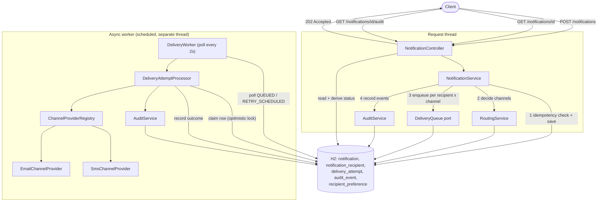

# Architecture

Notification Management Service — architecture overview and Architecture
Decision Records (ADRs) for the greenfield (Phase 1) build. See `README.md`
for setup/run instructions.

## 1. System Overview

A Spring Boot 4 / Java 21 service that accepts notification requests from
upstream systems, decides delivery channels per recipient, dispatches
delivery attempts asynchronously through simulated provider integrations,
and exposes status and audit history. Persistence is H2 (in-memory);
scheduling and persistence are the only infrastructure dependencies — no
external broker, cache, or message queue.

**Components:**

| Component | Package | Responsibility |
|---|---|---|
| `NotificationController` | `notification` | HTTP surface: submit, get status, get audit trail |
| `NotificationService` | `notification` | Validation, idempotency check, orchestrates routing + queuing |
| `NotificationStatusCalculator` | `notification` | Pure function deriving overall status from delivery attempts |
| `RoutingService` | `routing` | Decides eligible channels per recipient |
| `DeliveryQueue` / `DeliveryAttemptQueue` | `delivery` | Port + adapter for enqueuing a delivery attempt |
| `DeliveryWorker` | `delivery` | `@Scheduled` poller — the async processing loop |
| `DeliveryAttemptProcessor` | `delivery` | Processes one delivery attempt per transaction |
| `ChannelProviderRegistry` + `EmailChannelProvider` / `SmsChannelProvider` | `delivery` (+ `.providers`) | Simulated channel adapters |
| `AuditService` | `audit` | Records audit trail events |

## 2. Control Flow



**Narrative:**
1. `POST /api/v1/notifications` validates the request, checks the
   `(sourceSystem, idempotencyKey)` dedup boundary, persists the
   `Notification` + `NotificationRecipient` rows, and records
   `NOTIFICATION_ACCEPTED`.
2. For each recipient, `RoutingService` decides eligible channels;
   `DeliveryQueue.enqueue(...)` persists one `DeliveryAttempt` row per
   recipient × channel; each step is audited (`ROUTING_DECIDED`,
   `DELIVERY_QUEUED`).
3. The request returns **202 Accepted** here — no delivery has happened yet.
   This is the asynchronous boundary: nothing past this point runs on the
   request thread.
4. `DeliveryWorker` polls for due rows every 2s (configurable), and hands
   each to `DeliveryAttemptProcessor`, which claims the row under optimistic
   locking, calls the resolved `ChannelProvider`, and records the outcome
   (`DELIVERY_ATTEMPTED` → `DELIVERY_SUCCEEDED`/`DELIVERY_FAILED`).
5. `GET /notifications/{id}` derives the overall status live from the
   `DeliveryAttempt` rows (see ADR-004) rather than trusting a
   separately-maintained flag.

## 3. Project Structure

```
com/nms/
├── common/       shared enums (Channel, Severity, Priority, statuses, FailureType)
├── notification/ aggregate root: submission + status API (+ dto/)
├── routing/      channel routing decision
├── delivery/     async delivery outbox, worker, providers (+ providers/)
├── audit/        audit trail
├── exception/    cross-cutting error handling
└── config/       scheduling configuration
```

Packages are organized **by business capability** (`notification`,
`routing`, `delivery`, `audit`), not by technical layer
(`controller/service/repository/entity`). Full rationale in **ADR-001**
below; in short:

- A feature = a folder. Everything needed to understand "how delivery
  works" is in `delivery/`, not scattered across four parallel layer
  folders.
- Import direction is visible and reviewable: `notification` depending on
  `delivery` internals is a line you can see in a diff, not something only
  a folder-naming convention discourages.
- Each of the three assignment scenarios (greenfield, brownfield,
  ambiguous-requirement) maps to touching one package almost exclusively
  (`delivery/` for the brownfield channel+refactor work, `routing/` for the
  ambiguous routing-precedence resolution) — the structure was chosen with
  that evolution already in mind, not just for Phase 1's shape.
- Matches current Spring team guidance (see Spring Modulith) for how a
  Spring Boot application should be modularized as it grows past a toy
  size.

## 4. Architecture Decision Records

### ADR-001 — Package-by-feature module structure
**Status:** Accepted

**Context:** Need a package layout supporting a growing set of concerns
(intake, routing, async delivery, audit) across three build phases without
churning shared folders on every change.

**Decision:** Organize by business capability rather than technical layer
(see §3 above).

**Alternatives considered:**
- *Package-by-layer* (`controller/`, `service/`, `repository/`, `entity/`,
  `dto/`) — the classic Spring-tutorial layout. Rejected: a single feature
  change touches N unrelated folders, and nothing stops any controller from
  calling any repository directly — boundaries exist only by convention.
- *Multi-module Maven build* (separate JARs per capability) — rejected as
  disproportionate ceremony for a 6-hour prototype.

**Consequences:**
- \+ Feature-local reasoning; new capability = new package, not new files
  scattered across five existing folders.
- \+ Dependency direction between modules is visible in imports (enabled
  ADR-006's port to be introduced cleanly).
- \+ Scales toward a real modular monolith without a rewrite.
- − Less familiar to engineers who only know the layered-tutorial style.
- − No compiler-enforced boundaries (Spring Modulith's verification tests
  would add that; out of scope here — documented limitation).

---

### ADR-002 — DB-backed outbox + scheduled poller for async processing
**Status:** Accepted

**Context:** Requirement 4.1 needs asynchronous delivery processing;
requirement 4.4 requires that reprocessing a queued delivery not create
duplicate side effects. No message broker was present in the starter
project, and standing one up costs setup time disproportionate to a
6-hour budget.

**Decision:** Model delivery attempts as persisted `DeliveryAttempt` rows
(an outbox) with an explicit status state machine (`QUEUED → SENDING →
SUCCEEDED/FAILED/RETRY_SCHEDULED → EXHAUSTED`). A `@Scheduled` poller
(`DeliveryWorker`) finds due rows; `DeliveryAttemptProcessor` claims a row
(flips it to `SENDING`) under optimistic locking (`@Version`) before
calling the provider.

**Alternatives considered:**
- *Kafka/RabbitMQ + consumer* — most production-realistic; rejected here
  purely on time budget, documented as the natural swap-in for production
  (the `ChannelProvider`/`DeliveryQueue` seams don't change).
- *`@Async` in-memory queue* — simpler, but not durable across restarts and
  gives a materially weaker story for the "no duplicate reprocessing"
  requirement.

**Consequences:**
- \+ Zero extra infrastructure — runs on the same H2 instance.
- \+ Durable: survives an application restart because state is a row, not
  RAM.
- \+ The optimistic-lock claim step is what actually makes "no duplicate
  reprocessing" true under concurrent worker ticks, not just documented
  intent.
- \+ Every transition is already audit-loggable because it's already in the
  DB.
- − Single-node poller today; horizontal scale needs `SELECT ... FOR UPDATE
  SKIP LOCKED` or partitioning — called out as a production follow-up.
- − Polling interval (2s default) adds latency vs. a push-based broker.

---

### ADR-003 — Two-tier deduplication & idempotency boundary
**Status:** Accepted

**Context:** Requirement 4.4: a repeated submission with the same
idempotency key must not create a second logical notification; reprocessing
a queued delivery must not create uncontrolled duplicate side effects; the
boundary and retention policy must be documented.

**Decision:** Two independent unique constraints:
- **Submission boundary:** `UNIQUE(source_system, idempotency_key)` on
  `Notification`. A repeat returns the existing notification
  (`200`, `duplicate:true`) instead of erroring or silently duplicating.
- **Delivery boundary:** `UNIQUE(notification_id, recipient_id, channel)`
  on `DeliveryAttempt`, combined with the optimistic-lock claim from
  ADR-002.
- **Retention (documented, not yet automated):** rows are retained
  indefinitely in this prototype. A production deployment should TTL/archive
  idempotency keys after a bounded window (e.g. 7–30 days, matching how
  long a source system might realistically retry) — see
  `TESTING_AND_LIMITATIONS.md`.

**Alternatives considered:**
- *Global (non-scoped) idempotency key uniqueness* — rejected: two
  different upstream systems could legitimately reuse the same key value;
  scoping to `sourceSystem` is the realistic boundary.
- *Application-level cache (e.g. Caffeine) for dedup* — rejected: not
  durable across restarts, and duplicates a guarantee the database already
  gives for free via a unique index.

**Consequences:**
- \+ Both boundaries are enforced by the database itself, correct even
  under concurrent requests — not just application-level "check then act"
  logic, which would race.
- \+ Deduplication is visible in the audit trail (`NOTIFICATION_DEDUPLICATED`),
  satisfying 4.4's "must be reflected in status or audit history."
- − Retention policy is documented, not yet enforced — a known,
  intentional gap given the time budget.

---

### ADR-004 — Derived (not independently mutated) notification status
**Status:** Accepted

**Context:** Requirement 4.2 explicitly allows a custom state model "if
documented and defensible," and requires overall status, selected
channels, and per-recipient/per-channel delivery status.

**Decision:** `NotificationStatusCalculator` computes the overall
`NotificationStatus` purely from that notification's `DeliveryAttempt`
rows: any in-flight attempt → `PROCESSING`; zero deliverable units or zero
successes → `FAILED`; every unit succeeded → `DELIVERED`; a mix →
`PARTIALLY_DELIVERED`. The stored `Notification.status` field is refreshed
opportunistically from this calculation on read/write, but is never treated
as authoritative on its own.

**Alternatives considered:**
- *Imperative state machine* — manually transition `Notification.status` at
  each step. Rejected: easy for the flag to drift from the underlying
  facts (e.g. forgetting to flip to `PARTIALLY_DELIVERED` when a second
  recipient fails); a derived value structurally cannot drift.

**Consequences:**
- \+ Status can never be inconsistent with the actual delivery attempts.
- \+ The derivation rule is a single, pure, directly unit-tested function
  (`NotificationStatusCalculatorTest`).
- − Recomputed on every status read — O(recipients × channels); fine at
  prototype scale, would need a materialized projection at high read
  volume.

---

### ADR-005 — DTOs at every API boundary
**Status:** Accepted

**Decision:** `NotificationController` only ever sends/receives records
from `notification.dto` — never `Notification`, `NotificationRecipient`, or
`DeliveryAttempt` entities directly.

**Consequences:**
- \+ The wire contract is decoupled from the persistence model — a JPA
  schema change doesn't silently change the API.
- \+ Avoids Jackson serializing lazy-loaded proxies or triggering N+1
  queries from the web layer.
- \+ Request/response shape is self-documenting via Bean Validation
  annotations on the DTOs themselves.
- − Manual mapping code (no MapStruct) — acceptable at this size; would
  introduce a mapper if the DTO surface grew materially.

---

### ADR-006 — Explicit module port (`DeliveryQueue`) instead of cross-module repository access
**Status:** Accepted (refactored from the initial Phase 1 cut)

**Context:** `NotificationService` initially depended directly on
`DeliveryAttemptRepository` and constructed `DeliveryAttempt` entities to
enqueue deliveries — a write into another module's aggregate from outside
that module.

**Decision:** Introduced `DeliveryQueue` (interface, owned by `delivery/`)
exposing `enqueue(notificationId, recipientId, channel, firstAttemptAt)`;
`DeliveryAttemptQueue` implements it. `notification/` now depends only on
the interface for writes. Read-side status queries still query
`DeliveryAttemptRepository` directly — reading another module's data to
project a status view is treated as an acceptable allowance (it doesn't
mutate `delivery`'s aggregate), so no symmetric read port was introduced.

**Consequences:**
- \+ Write dependency direction is explicit and one-directional; `delivery`
  can change `DeliveryAttempt`'s internal shape without touching
  `notification`.
- \+ The module boundary is now something visible in the dependency graph,
  not just a folder-naming convention.
- − One extra interface + implementation file for a single method — small
  ceremony that only pays off as the codebase grows past prototype size.

---

### ADR-007 — Simulated channel providers with deterministic failure injection
**Status:** Accepted

**Context:** No real Email/SMS provider credentials (SES, Twilio, etc.) are
available for a take-home assignment; requirement 4.5 requires
distinguishing six failure categories (transient, permanent, invalid
recipient, rate-limit, timeout, auth error).

**Decision:** `EmailChannelProvider`/`SmsChannelProvider` are in-process
mocks whose outcome is decided by substring markers in `recipientId`
(`invalid-`, `ratelimit-`, `timeout-`, `authfail-`, `failtransient-`,
`failpermanent-`) — anything else succeeds.

**Consequences:**
- \+ Every failure path in 4.5 is reproducible on demand for demos and
  tests, with no flaky network dependency or mocking framework required.
- − Doesn't validate real integration concerns (token refresh, actual
  rate-limit headers, payload limits) — an explicit, documented prototype
  limitation. `ChannelProvider` is the seam a real integration implements.

---

### ADR-008 — Client-generated UUID primary keys
**Status:** Accepted

**Decision:** Entities set `private UUID id = UUID.randomUUID()` as a field
initializer rather than a DB-generated strategy.

**Alternatives considered:** `@GeneratedValue(strategy =
GenerationType.UUID)` (Jakarta Persistence 3.2) — works, but ties
correctness to the exact Hibernate/JPA provider version; a manually
initialized field has no such framework-version dependency and an
identical practical outcome.

**Consequences:**
- \+ Entity has real identity before the first `save()` — useful for
  audit/log correlation before a flush.
- \+ No DB round-trip needed for ID assignment; portable across dialects.
- − Random UUIDs are less index-friendly than sequential IDs at very large
  scale (B-tree page-split churn) — accepted trade-off; a production
  follow-up would consider a time-ordered ID (ULID/UUIDv7).

---

### Planned ADRs (reserved numbers, already referenced in code comments)

These are intentionally **not yet decided** — the code has forward
references to them so the eventual decision has an obvious home.

- **ADR-009** (Phase 2 — Brownfield): extract the failure-simulation logic
  duplicated between `EmailChannelProvider` and `SmsChannelProvider` into a
  shared component before adding the third (`WEBHOOK`) provider.
  Referenced today in `SmsChannelProvider`'s Javadoc.
- **ADR-010** (Phase 3 — Ambiguous Requirement): channel routing precedence
  when requested channel, severity, recipient preference, and routing
  policy conflict — the requirement (4.3) lists these as inputs without
  defining precedence. Referenced today in `RoutingService`'s Javadoc,
  which is deliberately left at its Phase-1 (opt-out-only) behavior pending
  this decision.
